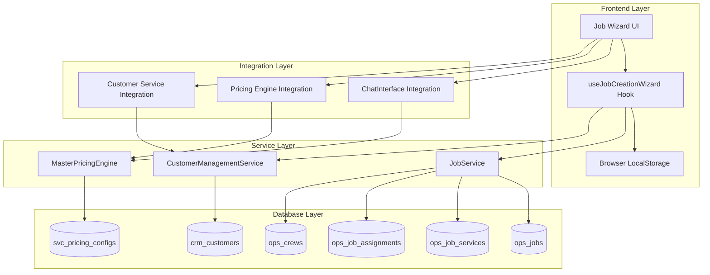
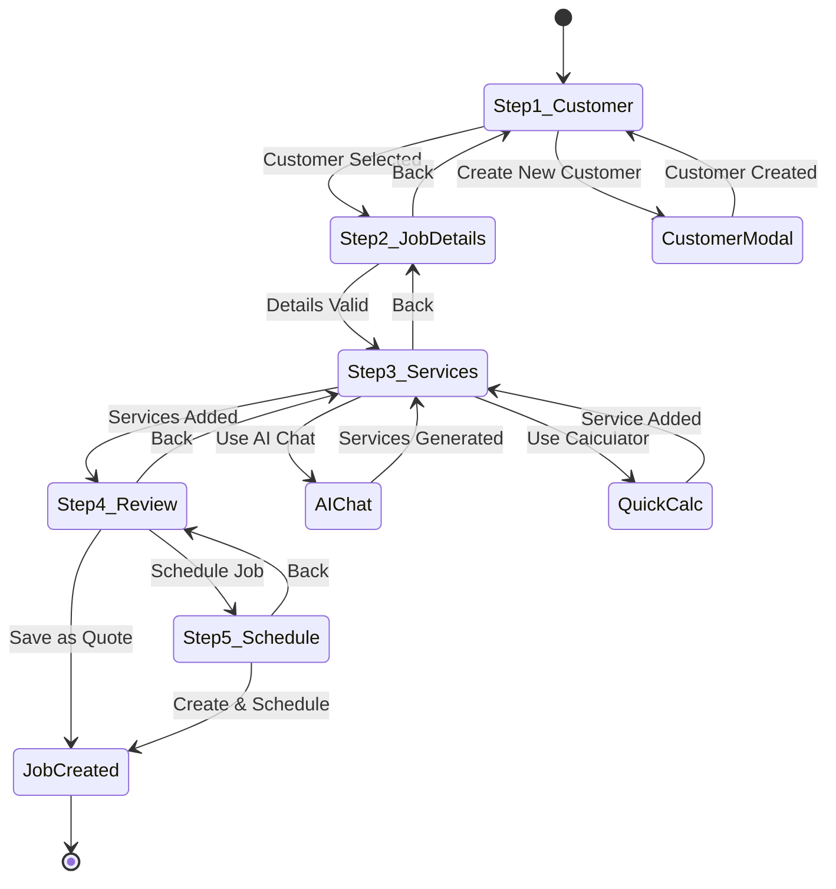
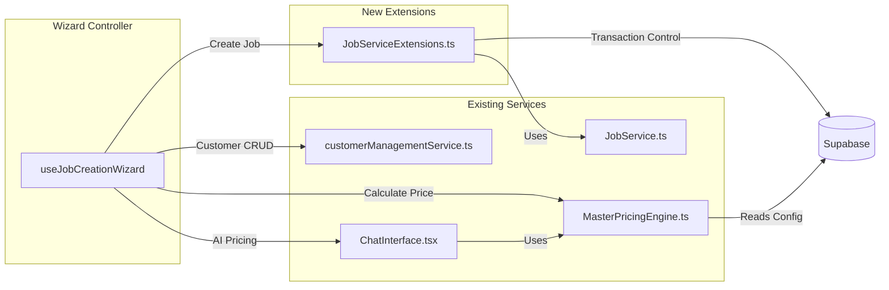
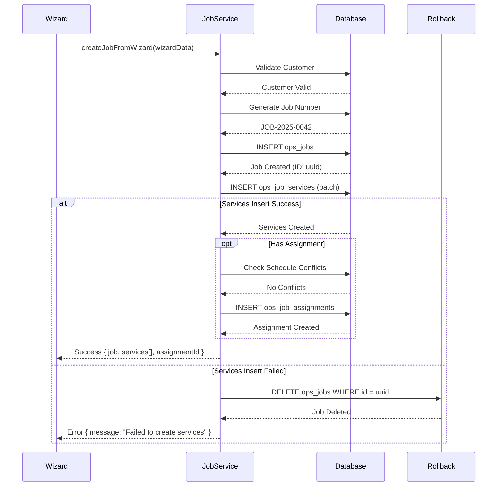
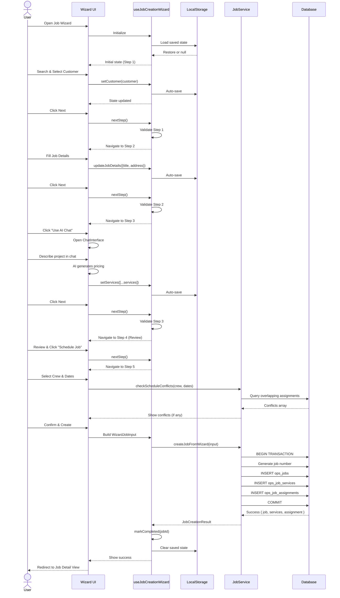
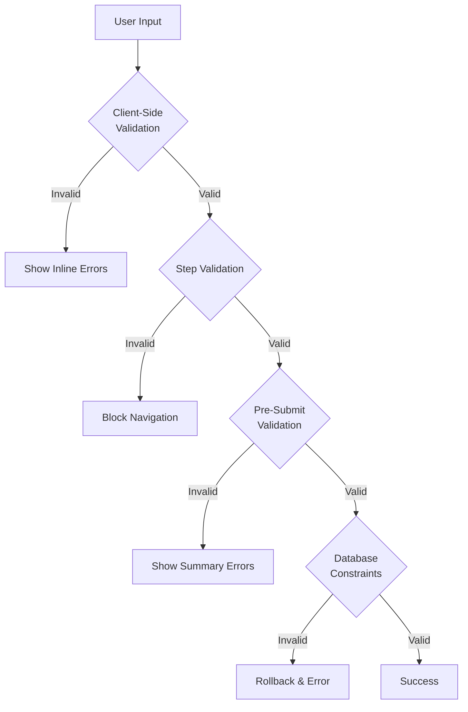
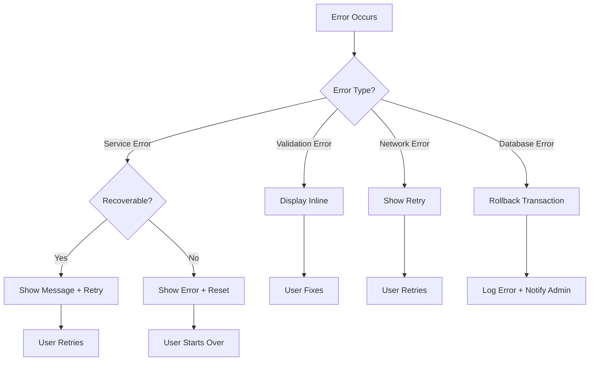

# Job Creation Wizard - Complete Architecture

**Version:** 1.0
**Date:** October 24, 2025
**Author:** Backend System Architect

---

## Table of Contents

1. [System Overview](#system-overview)
2. [Architecture Diagrams](#architecture-diagrams)
3. [State Management](#state-management)
4. [Service Layer Integration](#service-layer-integration)
5. [Data Flow](#data-flow)
6. [Validation Strategy](#validation-strategy)
7. [Error Handling](#error-handling)
8. [Integration Patterns](#integration-patterns)
9. [API Contracts](#api-contracts)
10. [Testing Strategy](#testing-strategy)

---

## 1. System Overview

### 1.1 Purpose

The Job Creation Wizard provides a guided 5-step workflow for creating jobs with integrated customer management, AI-powered pricing, and crew scheduling. It ensures data consistency, validation at each step, and seamless integration with existing services.

### 1.2 Key Requirements

- **Multi-step state management** with forward/backward navigation
- **Step-level validation** before progression
- **Customer inline creation** without losing wizard context
- **AI Chat & Quick Calculator integration** for service pricing
- **Optional crew scheduling** with conflict detection
- **Atomic job creation** (rollback on failure)
- **Session persistence** for draft jobs

### 1.3 Technology Stack

- **Frontend:** React 18+ with TypeScript
- **State Management:** React Hooks (useJobCreationWizard)
- **Backend:** Supabase (PostgreSQL + Row-Level Security)
- **Services:** JobService, CustomerManagementService, MasterPricingEngine
- **AI Integration:** Existing ChatInterface component

---

## 2. Architecture Diagrams

### 2.1 High-Level System Architecture



### 2.2 Wizard State Flow



### 2.3 Service Integration Architecture



---

## 3. State Management

### 3.1 Hook Architecture

**File:** `src/hooks/useJobCreationWizard.ts`

```typescript
// Core state structure
interface JobWizardState {
  currentStep: WizardStep;          // 1-5
  customer: CustomerProfile | null;  // Step 1
  jobDetails: JobDetailsData;        // Step 2
  services: ServiceLineItem[];       // Step 3
  saveAsQuote: boolean;              // Step 4
  schedule: ScheduleData | null;     // Step 5 (optional)
  isCompleted: boolean;
  errors: Record<string, string>;
}
```

### 3.2 State Persistence Strategy

**LocalStorage Schema:**

```json
{
  "job-wizard-state-{companyId}": {
    "currentStep": 2,
    "customer": { ... },
    "jobDetails": { ... },
    "services": [ ... ],
    "saveAsQuote": true,
    "schedule": null,
    "isCompleted": false,
    "timestamp": "2025-10-24T10:30:00Z"
  }
}
```

**Persistence Rules:**

1. **Auto-save on every state change** (debounced 500ms)
2. **Clear on job creation success**
3. **Restore on wizard mount** (if not completed)
4. **Expire after 7 days** of inactivity
5. **Clear on logout** via cleanup hook

### 3.3 Validation Architecture

**Step-by-Step Validation:**

```typescript
// Validation functions per step
const validateStep1 = (state) => {
  // Customer must be selected
  return { isValid: !!state.customer, errors: {} };
};

const validateStep2 = (state) => {
  // Title, address, priority required
  const errors = {};
  if (!state.jobDetails.title) errors.title = 'Required';
  if (!state.jobDetails.service_address) errors.address = 'Required';
  return { isValid: Object.keys(errors).length === 0, errors };
};

const validateStep3 = (state) => {
  // At least one service required
  return {
    isValid: state.services.length > 0,
    errors: state.services.length === 0 ? { services: 'Add at least one service' } : {}
  };
};

const validateStep4 = (state) => {
  // Always valid (review only)
  return { isValid: true, errors: {} };
};

const validateStep5 = (state, requireScheduling) => {
  // Validate crew, dates if scheduling
  if (!requireScheduling && !state.schedule) {
    return { isValid: true, errors: {} }; // Skip scheduling
  }

  const errors = {};
  if (!state.schedule?.crew_id) errors.crew = 'Required';
  if (!state.schedule?.scheduled_start) errors.start = 'Required';

  return { isValid: Object.keys(errors).length === 0, errors };
};
```

---

## 4. Service Layer Integration

### 4.1 JobService Extensions

**File:** `src/services/JobServiceExtensions.ts`

#### Method: `createJobFromWizard`

**Purpose:** Atomic job creation with services and optional assignment

**Transaction Flow:**



**Method Signature:**

```typescript
async createJobFromWizard(
  input: WizardJobInput
): Promise<ServiceResponse<JobCreationResult>>

// Input structure
interface WizardJobInput {
  company_id: string;
  customer_id: string;
  title: string;
  service_address: string;
  priority: number;
  status: 'quote' | 'approved';
  services: CreateJobServiceInput[];
  assignment?: {
    crew_id: string;
    scheduled_start: string;
    scheduled_end: string;
    estimated_hours?: number;
    assigned_by_user_id: string;
  };
  created_by_user_id: string;
}

// Output structure
interface JobCreationResult {
  job: Job;
  services: string[];      // Array of service IDs
  assignmentId?: string;   // Created assignment ID
}
```

#### Method: `generateJobNumber`

**Purpose:** Generate sequential job numbers with company isolation

**Algorithm:**

```typescript
// Format: JOB-{YEAR}-{SEQUENCE}
// Example: JOB-2025-0042

const generateJobNumber = async (companyId: string): Promise<string> => {
  const year = new Date().getFullYear();
  const prefix = `JOB-${year}-`;

  // Get highest number for this year
  const { data } = await supabase
    .from('ops_jobs')
    .select('job_number')
    .eq('company_id', companyId)
    .like('job_number', `${prefix}%`)
    .order('job_number', { ascending: false })
    .limit(1);

  let nextNumber = 1;
  if (data && data.length > 0) {
    const match = data[0].job_number.match(/JOB-\d{4}-(\d+)/);
    nextNumber = parseInt(match[1]) + 1;
  }

  return `${prefix}${String(nextNumber).padStart(4, '0')}`;
};
```

**Concurrency Handling:**

- Database-level ordering ensures correct sequence
- No explicit locking required (PostgreSQL MVCC)
- Gap tolerance acceptable (deleted jobs leave gaps)

#### Method: `checkScheduleConflicts`

**Purpose:** Detect overlapping crew assignments

**Conflict Detection Logic:**

```sql
-- SQL query for conflict detection
SELECT *
FROM ops_job_assignments
WHERE crew_id = $1
  AND status != 'cancelled'
  AND (
    (scheduled_start <= $3 AND scheduled_end >= $2)
  );

-- Parameters:
-- $1: crew_id
-- $2: requested_start
-- $3: requested_end
```

**Conflict Response:**

```typescript
interface ScheduleConflict {
  crew_id: string;
  crew_name: string;
  requested_start: string;
  requested_end: string;
  conflicting_assignments: Array<{
    assignment_id: string;
    job_id: string;
    job_number: string;
    job_title: string;
    scheduled_start: string;
    scheduled_end: string;
  }>;
}
```

### 4.2 Customer Service Integration

**Inline Customer Creation Pattern:**

```typescript
// Wizard UI
const handleCreateCustomer = async (customerData) => {
  // Open customer modal (does NOT close wizard)
  setShowCustomerModal(true);

  // On customer creation success:
  const newCustomer = await customerManagementService.createCustomer({
    company_id: companyId,
    created_by_user_id: userId,
    ...customerData
  });

  if (newCustomer.success) {
    // Auto-select customer in wizard
    wizard.setCustomer(newCustomer.customer);

    // Auto-populate address in Step 2
    wizard.updateJobDetails({
      service_address: newCustomer.customer.customer_address
    });

    // Close modal and advance to Step 2
    setShowCustomerModal(false);
    wizard.nextStep();
  }
};
```

### 4.3 Pricing Engine Integration

#### AI Chat Integration (Step 3 - Option A)

```typescript
// Wizard UI Component
import { ChatInterface } from '@/components/ChatInterface';

const ServicesStep = () => {
  const wizard = useJobCreationWizard(config);
  const [showChat, setShowChat] = useState(false);

  const handleChatComplete = (chatResult: any) => {
    // Extract services from AI chat session
    const services: ServiceLineItem[] = chatResult.services.map(svc => ({
      service_config_id: svc.serviceConfigId,
      service_name: svc.serviceName,
      service_description: svc.description,
      quantity: svc.quantity || 1,
      unit_price: svc.unitPrice,
      total_price: svc.totalPrice,
      calculation_data: svc.calculationData,
      pricing_variables: svc.pricingVariables
    }));

    // Set services in wizard state
    wizard.setServices(services);

    // Close chat and return to wizard
    setShowChat(false);
  };

  return (
    <>
      {showChat ? (
        <ChatInterface
          mode="embedded"
          customerId={wizard.customer?.id}
          onComplete={handleChatComplete}
          onCancel={() => setShowChat(false)}
        />
      ) : (
        <div>
          <button onClick={() => setShowChat(true)}>
            Use AI Chat
          </button>
          {/* Service line items table */}
        </div>
      )}
    </>
  );
};
```

#### Quick Calculator Integration (Step 3 - Option B)

```typescript
import { masterPricingEngine } from '@/pricing-system/core/calculations/master-pricing-engine';

const handleQuickCalculate = async (
  serviceName: string,
  variables: Record<string, any>
) => {
  // Call pricing engine directly
  const result = await masterPricingEngine.calculatePricing(
    variables,
    variables.sqft,
    serviceName,
    companyId,
    serviceConfigId
  );

  // Create service line item
  const newService: ServiceLineItem = {
    service_config_id: serviceConfigId,
    service_name: serviceName,
    service_description: result.breakdown || '',
    quantity: 1,
    unit_price: result.tier2Results.total,
    total_price: result.tier2Results.total,
    calculation_data: {
      tier1Results: result.tier1Results,
      tier2Results: result.tier2Results,
      sqft: result.sqft,
      inputValues: variables,
      confidence: result.confidence,
      calculationDate: result.calculationDate
    },
    pricing_variables: variables
  };

  // Add to wizard state
  wizard.addService(newService);
};
```

---

## 5. Data Flow

### 5.1 Complete Wizard Flow



### 5.2 Step-by-Step Data Mapping

#### Step 1 → Step 2: Customer to Address Auto-fill

```typescript
// When customer is selected
wizard.setCustomer(selectedCustomer);

// Hook automatically populates address
useEffect(() => {
  if (customer && !jobDetails.service_address) {
    updateJobDetails({
      service_address: customer.customer_address || '',
      // Optional: Parse address components
      // service_city: extractCity(customer.customer_address),
      // service_state: extractState(customer.customer_address),
    });
  }
}, [customer]);
```

#### Step 3 → Step 4: Services to Estimated Total

```typescript
// Computed value in hook
const estimatedTotal = useMemo(() => {
  return services.reduce((sum, svc) => sum + svc.total_price, 0);
}, [services]);

// Display in Step 4
<div className="review-total">
  <span>Estimated Total:</span>
  <span>${estimatedTotal.toFixed(2)}</span>
</div>
```

#### Step 4 → Database: Complete Job Creation

```typescript
// Build complete input from wizard state
const wizardInput: WizardJobInput = {
  company_id: companyId,
  customer_id: wizard.customer!.id,
  title: wizard.jobDetails.title,
  description: wizard.jobDetails.description,
  service_address: wizard.jobDetails.service_address,
  service_city: wizard.jobDetails.service_city,
  service_state: wizard.jobDetails.service_state,
  service_zip: wizard.jobDetails.service_zip,
  priority: wizard.jobDetails.priority,
  requested_start_date: wizard.jobDetails.requested_start_date,
  tags: wizard.jobDetails.tags,
  status: wizard.saveAsQuote ? 'quote' : 'approved',

  // Services from Step 3
  services: wizard.services.map(svc => ({
    service_config_id: svc.service_config_id,
    service_name: svc.service_name,
    service_description: svc.service_description,
    quantity: svc.quantity,
    unit_price: svc.unit_price,
    total_price: svc.total_price,
    calculation_data: svc.calculation_data,
    pricing_variables: svc.pricing_variables,
    notes: svc.notes,
    metadata: svc.metadata,
    added_by_user_id: userId
  })),

  // Assignment from Step 5 (if provided)
  assignment: wizard.schedule ? {
    crew_id: wizard.schedule.crew_id,
    scheduled_start: wizard.schedule.scheduled_start,
    scheduled_end: wizard.schedule.scheduled_end,
    estimated_hours: wizard.schedule.estimated_hours,
    assignment_notes: wizard.schedule.assignment_notes,
    assigned_by_user_id: userId
  } : undefined,

  created_by_user_id: userId
};

// Submit to service
const result = await jobService.createJobFromWizard(wizardInput);
```

---

## 6. Validation Strategy

### 6.1 Multi-Layer Validation



### 6.2 Validation Layers

#### Layer 1: Real-time Field Validation

```typescript
// Input component validation
<Input
  value={jobDetails.title}
  onChange={(e) => updateJobDetails({ title: e.target.value })}
  error={errors.title}
  validate={(value) => {
    if (!value.trim()) return 'Title is required';
    if (value.length < 3) return 'Title must be at least 3 characters';
    if (value.length > 100) return 'Title must be less than 100 characters';
    return null;
  }}
/>
```

#### Layer 2: Step-Level Validation

```typescript
// Before navigating to next step
const nextStep = () => {
  const validation = validateCurrentStep();

  if (!validation.isValid) {
    setState(prev => ({ ...prev, errors: validation.errors }));
    toast.error('Please fix the errors before continuing');
    return;
  }

  // Clear errors and advance
  setState(prev => ({
    ...prev,
    currentStep: prev.currentStep + 1,
    errors: {}
  }));
};
```

#### Layer 3: Pre-Submission Validation

```typescript
// Before calling createJobFromWizard
const handleSubmit = async () => {
  // Validate complete wizard data
  const validation = await jobService.validateWizardData(wizardInput);

  if (!validation.success || !validation.data.valid) {
    setErrors(validation.data.errors);
    toast.error('Validation failed. Please review the errors.');
    return;
  }

  // Proceed with creation
  const result = await jobService.createJobFromWizard(wizardInput);
};
```

#### Layer 4: Database Constraints

```sql
-- ops_jobs table constraints
ALTER TABLE ops_jobs
  ADD CONSTRAINT job_title_not_empty CHECK (title != ''),
  ADD CONSTRAINT job_priority_range CHECK (priority >= 0 AND priority <= 10),
  ADD CONSTRAINT job_estimated_total_positive CHECK (estimated_total >= 0);

-- ops_job_services constraints
ALTER TABLE ops_job_services
  ADD CONSTRAINT service_quantity_positive CHECK (quantity > 0),
  ADD CONSTRAINT service_unit_price_positive CHECK (unit_price >= 0),
  ADD CONSTRAINT service_total_price_positive CHECK (total_price >= 0);
```

### 6.3 Error Display Strategy

```typescript
// Error types and display locations
interface ValidationErrors {
  // Field-level errors (inline, red text below input)
  fieldErrors: Record<string, string>;

  // Step-level errors (alert banner at top of step)
  stepErrors: string[];

  // Global errors (toast notification)
  globalErrors: string[];
}

// Example error state
{
  fieldErrors: {
    'title': 'Title is required',
    'service_address': 'Address must be valid'
  },
  stepErrors: [
    'Please complete all required fields before continuing'
  ],
  globalErrors: []
}
```

---

## 7. Error Handling

### 7.1 Error Hierarchy



### 7.2 Error Types & Handling

#### Validation Errors (Client-Side)

```typescript
// Show inline below field
<Input
  value={value}
  error={errors.fieldName}
  helperText="Enter a valid value"
/>

// Block navigation
const canProceed = validateStep(currentStep).isValid;
<Button disabled={!canProceed}>Next</Button>
```

#### Service Errors (Server-Side)

```typescript
// Example: Customer not found
const result = await jobService.createJobFromWizard(input);

if (!result.success) {
  if (result.error === 'Customer not found') {
    // Specific handling
    toast.error('Selected customer no longer exists. Please select another.');
    wizard.goToStep(1); // Return to customer selection
  } else {
    // Generic error
    toast.error(`Failed to create job: ${result.error}`);
  }
}
```

#### Transaction Errors (Database)

```typescript
// JobService handles rollback internally
async createJobFromWizard(input) {
  const { data: job } = await supabase
    .from('ops_jobs')
    .insert(jobData)
    .select()
    .single();

  const { error: servicesError } = await supabase
    .from('ops_job_services')
    .insert(serviceInserts);

  if (servicesError) {
    // ROLLBACK: Delete created job
    await supabase.from('ops_jobs').delete().eq('id', job.id);

    return this.error('Failed to create services. Transaction rolled back.');
  }

  return this.success(result);
}
```

#### Network Errors

```typescript
// Detect and handle network failures
try {
  const result = await jobService.createJobFromWizard(input);
} catch (error) {
  if (error instanceof TypeError && error.message === 'Failed to fetch') {
    toast.error('Network error. Please check your connection and retry.');
    setShowRetryButton(true);
  } else {
    toast.error('An unexpected error occurred. Please try again.');
    console.error('[Wizard] Unexpected error:', error);
  }
}
```

### 7.3 Rollback Strategy

**Scenario:** Job created, but service insertion fails

```typescript
// Atomic creation with manual rollback
async createJobFromWizard(input) {
  let createdJobId: string | null = null;

  try {
    // Step 1: Create job
    const { data: job, error: jobError } = await supabase
      .from('ops_jobs')
      .insert(jobData)
      .select()
      .single();

    if (jobError) throw new Error('Job creation failed');

    createdJobId = job.id;

    // Step 2: Create services
    const { error: servicesError } = await supabase
      .from('ops_job_services')
      .insert(serviceInserts);

    if (servicesError) {
      throw new Error('Service creation failed');
    }

    // Step 3: Create assignment (if provided)
    if (input.assignment) {
      const { error: assignmentError } = await supabase
        .from('ops_job_assignments')
        .insert(assignmentData);

      if (assignmentError) {
        console.warn('Assignment creation failed, but job created successfully');
        // Note: NOT rolling back job/services for assignment failure
      }
    }

    return this.success(result);

  } catch (error) {
    // ROLLBACK: Clean up any created records
    if (createdJobId) {
      console.log('[JobService] Rolling back job:', createdJobId);
      await supabase.from('ops_jobs').delete().eq('id', createdJobId);
      // CASCADE DELETE will remove related services via foreign key
    }

    return this.error('Transaction failed and was rolled back', error);
  }
}
```

**Database CASCADE Configuration:**

```sql
-- Ensure cascade deletes for rollback
ALTER TABLE ops_job_services
  DROP CONSTRAINT IF EXISTS ops_job_services_job_id_fkey,
  ADD CONSTRAINT ops_job_services_job_id_fkey
    FOREIGN KEY (job_id)
    REFERENCES ops_jobs(id)
    ON DELETE CASCADE;

ALTER TABLE ops_job_assignments
  DROP CONSTRAINT IF EXISTS ops_job_assignments_job_id_fkey,
  ADD CONSTRAINT ops_job_assignments_job_id_fkey
    FOREIGN KEY (job_id)
    REFERENCES ops_jobs(id)
    ON DELETE CASCADE;
```

---

## 8. Integration Patterns

### 8.1 Chat Interface Integration (Step 3)

**Pattern:** Embedded Modal with State Handoff

```typescript
// ServicesStep.tsx
const ServicesStep = () => {
  const wizard = useJobCreationWizard(config);
  const [chatMode, setChatMode] = useState<'hidden' | 'embedded' | 'fullscreen'>('hidden');

  const handleOpenChat = () => {
    setChatMode('embedded');
  };

  const handleChatComplete = (chatResult: ChatResult) => {
    // Transform chat result to service line items
    const services = transformChatResultToServices(chatResult);

    // Update wizard state
    wizard.setServices(services);

    // Close chat
    setChatMode('hidden');

    // Show success message
    toast.success(`Added ${services.length} service(s) from AI chat`);
  };

  const handleChatCancel = () => {
    setChatMode('hidden');
  };

  return (
    <div className="services-step">
      {chatMode === 'hidden' ? (
        <>
          <button onClick={handleOpenChat}>Use AI Chat</button>
          <ServiceLineItemsTable services={wizard.services} />
        </>
      ) : (
        <ChatInterface
          mode={chatMode}
          customerId={wizard.customer!.id}
          companyId={companyId}
          onComplete={handleChatComplete}
          onCancel={handleChatCancel}
          initialContext={{
            customer: wizard.customer,
            jobTitle: wizard.jobDetails.title,
            serviceAddress: wizard.jobDetails.service_address
          }}
        />
      )}
    </div>
  );
};
```

**Chat Result Transformation:**

```typescript
// Transform AI chat output to wizard service format
const transformChatResultToServices = (
  chatResult: ChatResult
): ServiceLineItem[] => {
  return chatResult.services.map(service => ({
    service_config_id: service.serviceConfigId,
    service_name: service.serviceName,
    service_description: service.description,
    quantity: service.quantity || 1,
    unit_price: service.unitPrice,
    total_price: service.totalPrice,
    calculation_data: {
      tier1Results: service.tier1Results,
      tier2Results: service.tier2Results,
      sqft: service.sqft,
      inputValues: service.inputValues,
      confidence: service.confidence,
      calculationDate: new Date().toISOString()
    },
    pricing_variables: service.pricingVariables || {},
    notes: service.notes,
    metadata: {
      source: 'ai-chat',
      chat_session_id: chatResult.sessionId,
      conversation_id: chatResult.conversationId
    }
  }));
};
```

### 8.2 Pricing Engine Integration (Step 3)

**Pattern:** Direct Service Call with Result Mapping

```typescript
// QuickCalculator.tsx
import { masterPricingEngine } from '@/pricing-system/core/calculations/master-pricing-engine';

const QuickCalculator = () => {
  const wizard = useJobCreationWizard(config);
  const [selectedService, setSelectedService] = useState<string>('');
  const [variables, setVariables] = useState<Record<string, any>>({});

  const handleCalculate = async () => {
    // Call pricing engine directly
    const result = await masterPricingEngine.calculatePricing(
      variables,
      variables.sqft,
      selectedService,
      companyId,
      serviceConfigId
    );

    if (!result) {
      toast.error('Failed to calculate pricing');
      return;
    }

    // Create service line item
    const newService: ServiceLineItem = {
      service_config_id: serviceConfigId,
      service_name: selectedService,
      service_description: `${variables.sqft} sq ft`,
      quantity: 1,
      unit_price: result.tier2Results.total,
      total_price: result.tier2Results.total,
      calculation_data: {
        tier1Results: result.tier1Results,
        tier2Results: result.tier2Results,
        sqft: result.sqft,
        inputValues: variables,
        confidence: result.confidence,
        calculationDate: result.calculationDate
      },
      pricing_variables: variables,
      metadata: {
        source: 'quick-calculator',
        calculated_at: new Date().toISOString()
      }
    };

    // Add to wizard
    wizard.addService(newService);

    // Reset calculator
    setVariables({});
    toast.success('Service added');
  };

  return (
    <div className="quick-calculator">
      <ServiceDropdown
        value={selectedService}
        onChange={setSelectedService}
      />

      <PricingVariablesForm
        serviceConfigId={serviceConfigId}
        values={variables}
        onChange={setVariables}
      />

      <button onClick={handleCalculate}>
        Calculate & Add
      </button>
    </div>
  );
};
```

### 8.3 Customer Management Integration (Step 1)

**Pattern:** Inline Modal without Wizard Dismissal

```typescript
// CustomerSelectionStep.tsx
const CustomerSelectionStep = () => {
  const wizard = useJobCreationWizard(config);
  const [showCustomerModal, setShowCustomerModal] = useState(false);
  const [customerSearch, setCustomerSearch] = useState('');
  const [searchResults, setSearchResults] = useState<CustomerProfile[]>([]);

  const handleSearch = async (query: string) => {
    const results = await customerManagementService.searchCustomers(
      companyId,
      query
    );
    setSearchResults(results);
  };

  const handleSelectCustomer = (customer: CustomerProfile) => {
    wizard.setCustomer(customer);
    wizard.nextStep(); // Auto-advance to Step 2
  };

  const handleCreateNewCustomer = () => {
    setShowCustomerModal(true);
  };

  const handleCustomerCreated = async (customerData: Partial<CustomerProfile>) => {
    const result = await customerManagementService.createCustomer({
      company_id: companyId,
      created_by_user_id: userId,
      ...customerData
    });

    if (result.success && result.customer) {
      // Auto-select new customer
      wizard.setCustomer(result.customer);

      // Close modal
      setShowCustomerModal(false);

      // Auto-advance to Step 2
      wizard.nextStep();

      toast.success('Customer created and selected');
    } else {
      toast.error('Failed to create customer');
    }
  };

  return (
    <div className="customer-selection-step">
      <input
        type="text"
        placeholder="Search customers..."
        value={customerSearch}
        onChange={(e) => {
          setCustomerSearch(e.target.value);
          handleSearch(e.target.value);
        }}
      />

      <CustomerSearchResults
        results={searchResults}
        onSelect={handleSelectCustomer}
      />

      <button onClick={handleCreateNewCustomer}>
        + Create New Customer
      </button>

      {showCustomerModal && (
        <CustomerModal
          onSave={handleCustomerCreated}
          onCancel={() => setShowCustomerModal(false)}
        />
      )}
    </div>
  );
};
```

---

## 9. API Contracts

### 9.1 JobService API

#### `createJobFromWizard`

**Request:**

```typescript
POST /api/jobs/wizard

{
  company_id: "uuid",
  customer_id: "uuid",
  title: "Paver Patio Installation",
  description: "360 sq ft paver patio with excavation",
  service_address: "123 Main St",
  service_city: "Springfield",
  service_state: "IL",
  service_zip: "62701",
  priority: 5,
  status: "quote",
  requested_start_date: "2025-02-01",
  tags: ["paver", "patio", "residential"],
  services: [
    {
      service_config_id: "uuid",
      service_name: "Paver Patio",
      service_description: "360 sq ft paver patio installation",
      quantity: 1,
      unit_price: 85.00,
      total_price: 30600.00,
      calculation_data: { /* ... */ },
      pricing_variables: { sqft: 360 },
      added_by_user_id: "uuid"
    }
  ],
  assignment: {
    crew_id: "uuid",
    scheduled_start: "2025-02-01T08:00:00Z",
    scheduled_end: "2025-02-05T17:00:00Z",
    estimated_hours: 32,
    assigned_by_user_id: "uuid"
  },
  created_by_user_id: "uuid"
}
```

**Response (Success):**

```typescript
{
  success: true,
  data: {
    job: {
      id: "job-uuid",
      job_number: "JOB-2025-0042",
      title: "Paver Patio Installation",
      status: "quote",
      estimated_total: 30600.00,
      // ... all job fields
    },
    services: [
      "service-uuid-1",
      "service-uuid-2"
    ],
    assignmentId: "assignment-uuid"
  }
}
```

**Response (Error):**

```typescript
{
  success: false,
  error: "Customer not found or does not belong to company",
  details: "PostgreSQL error details here"
}
```

#### `checkScheduleConflicts`

**Request:**

```typescript
GET /api/jobs/schedule/conflicts?crew_id={uuid}&start={iso}&end={iso}
```

**Response:**

```typescript
{
  success: true,
  data: [
    {
      crew_id: "uuid",
      crew_name: "Crew Alpha",
      requested_start: "2025-02-01T08:00:00Z",
      requested_end: "2025-02-05T17:00:00Z",
      conflicting_assignments: [
        {
          assignment_id: "uuid",
          job_id: "uuid",
          job_number: "JOB-2025-0038",
          job_title: "Driveway Repair",
          scheduled_start: "2025-02-03T08:00:00Z",
          scheduled_end: "2025-02-04T17:00:00Z"
        }
      ]
    }
  ]
}
```

### 9.2 Wizard Hook API

```typescript
// Hook initialization
const wizard = useJobCreationWizard({
  companyId: 'uuid',
  userId: 'uuid',
  enableLocalStorage: true,
  storageKey: 'job-wizard-state-company-uuid',
  validateOnStepChange: true,
  requireScheduling: false
});

// Navigation API
wizard.nextStep();           // Advance if valid
wizard.prevStep();           // Go back
wizard.goToStep(3);          // Jump to specific step

// Data API
wizard.setCustomer(customer);
wizard.updateJobDetails({ title: 'New Title' });
wizard.addService(service);
wizard.updateService(0, { quantity: 2 });
wizard.removeService(1);
wizard.setSchedule(scheduleData);

// Validation API
const validation = wizard.validateCurrentStep();
if (!validation.isValid) {
  console.log('Errors:', validation.errors);
}

// Completion API
wizard.markCompleted('job-uuid');
wizard.reset();

// Persistence API
wizard.saveProgress();
wizard.loadProgress();
wizard.clearSavedProgress();

// Computed values
console.log('Total:', wizard.estimatedTotal);
console.log('Service count:', wizard.serviceCount);
console.log('Can proceed:', wizard.canGoNext);
```

---

## 10. Testing Strategy

### 10.1 Unit Tests

**Test Coverage:**

1. **Hook Tests** (`useJobCreationWizard.test.ts`)
   - State initialization
   - Step navigation (forward/backward)
   - Validation logic per step
   - Service CRUD operations
   - LocalStorage persistence

2. **Service Tests** (`JobServiceExtensions.test.ts`)
   - Job number generation (sequential, unique)
   - Atomic job creation (success & rollback)
   - Schedule conflict detection
   - Validation logic

3. **Integration Tests** (`WizardIntegration.test.ts`)
   - Customer selection → address auto-fill
   - AI chat → services transformation
   - Quick calculator → pricing calculation
   - Complete wizard flow → database records

### 10.2 Integration Tests

**Test Scenarios:**

```typescript
describe('Job Creation Wizard Integration', () => {
  test('Complete wizard flow: customer → job → services → schedule', async () => {
    // Step 1: Select customer
    const customer = await createTestCustomer();
    wizard.setCustomer(customer);

    // Step 2: Fill job details
    wizard.updateJobDetails({
      title: 'Test Job',
      service_address: '123 Test St',
      priority: 5
    });

    // Step 3: Add services via pricing engine
    const service = await calculateTestService();
    wizard.addService(service);

    // Step 4: Review
    wizard.setSaveAsQuote(false);

    // Step 5: Schedule
    const crew = await createTestCrew();
    wizard.setSchedule({
      crew_id: crew.id,
      scheduled_start: '2025-02-01T08:00:00Z',
      scheduled_end: '2025-02-05T17:00:00Z'
    });

    // Submit
    const input = buildWizardInput(wizard.state);
    const result = await jobService.createJobFromWizard(input);

    expect(result.success).toBe(true);
    expect(result.data.job.job_number).toMatch(/JOB-2025-\d{4}/);
    expect(result.data.services).toHaveLength(1);
    expect(result.data.assignmentId).toBeDefined();
  });

  test('Rollback on service creation failure', async () => {
    // Setup: Create job data with invalid service
    const input = createInvalidServiceInput();

    // Execute
    const result = await jobService.createJobFromWizard(input);

    // Assert: Job should NOT exist in database
    expect(result.success).toBe(false);

    const { data: job } = await supabase
      .from('ops_jobs')
      .select('id')
      .eq('title', input.title)
      .single();

    expect(job).toBeNull();
  });

  test('Schedule conflict detection', async () => {
    // Setup: Create existing assignment
    const crew = await createTestCrew();
    const existingJob = await createTestJob();
    await createAssignment({
      job_id: existingJob.id,
      crew_id: crew.id,
      scheduled_start: '2025-02-01T08:00:00Z',
      scheduled_end: '2025-02-05T17:00:00Z'
    });

    // Execute: Check conflicts for overlapping dates
    const conflicts = await jobService.checkScheduleConflicts(
      crew.id,
      '2025-02-03T08:00:00Z', // Overlaps with existing
      '2025-02-07T17:00:00Z'
    );

    // Assert
    expect(conflicts.success).toBe(true);
    expect(conflicts.data).toHaveLength(1);
    expect(conflicts.data[0].conflicting_assignments).toHaveLength(1);
  });
});
```

### 10.3 E2E Tests (Playwright)

```typescript
test('Create job via wizard', async ({ page }) => {
  // Navigate to jobs page
  await page.goto('/jobs');

  // Click Create Job button
  await page.click('[data-testid="create-job-button"]');

  // Step 1: Select customer
  await page.fill('[data-testid="customer-search"]', 'John Smith');
  await page.click('[data-testid="customer-result-0"]');
  await page.click('[data-testid="next-button"]');

  // Step 2: Fill job details
  await page.fill('[data-testid="job-title"]', 'Paver Patio Installation');
  await page.fill('[data-testid="service-address"]', '123 Main St');
  await page.selectOption('[data-testid="priority"]', '5');
  await page.click('[data-testid="next-button"]');

  // Step 3: Add services via AI chat
  await page.click('[data-testid="use-ai-chat-button"]');
  await page.fill('[data-testid="chat-input"]', '360 sq ft paver patio');
  await page.click('[data-testid="send-message"]');
  await page.waitForSelector('[data-testid="chat-result"]');
  await page.click('[data-testid="confirm-services"]');
  await page.click('[data-testid="next-button"]');

  // Step 4: Review
  await expect(page.locator('[data-testid="estimated-total"]')).toContainText('$');
  await page.click('[data-testid="schedule-job-button"]');

  // Step 5: Schedule
  await page.selectOption('[data-testid="crew-select"]', '0');
  await page.fill('[data-testid="start-date"]', '2025-02-01');
  await page.fill('[data-testid="end-date"]', '2025-02-05');
  await page.click('[data-testid="create-job-button"]');

  // Assert: Success message and redirect
  await expect(page.locator('[data-testid="success-toast"]')).toBeVisible();
  await expect(page).toHaveURL(/\/jobs\/JOB-2025-\d{4}/);
});
```

---

## Summary

This architecture provides:

✅ **Scalable state management** with React hooks
✅ **Atomic transactions** with rollback on failure
✅ **Seamless integrations** with existing services
✅ **Multi-layer validation** for data integrity
✅ **Persistent draft state** for user convenience
✅ **Conflict detection** for crew scheduling
✅ **Extensible design** for future enhancements

**Key Files Created:**

1. `src/hooks/useJobCreationWizard.ts` - State management hook
2. `src/services/JobServiceExtensions.ts` - Service layer methods
3. `docs/architecture/JOB-WIZARD-ARCHITECTURE.md` - This document

**Next Steps:**

1. Implement UI components for each wizard step
2. Add integration tests
3. Create E2E test suite
4. Performance optimization (debouncing, memoization)
5. Accessibility audit (WCAG 2.1 Level AA)

---

**Document Metadata:**
- Version: 1.0
- Last Updated: October 24, 2025
- Author: Backend System Architect
- Review Status: Ready for Implementation
