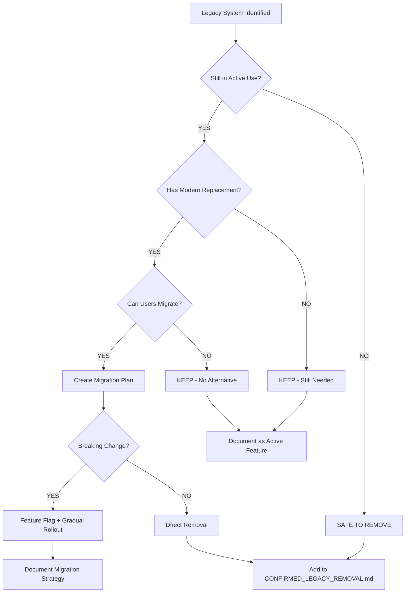
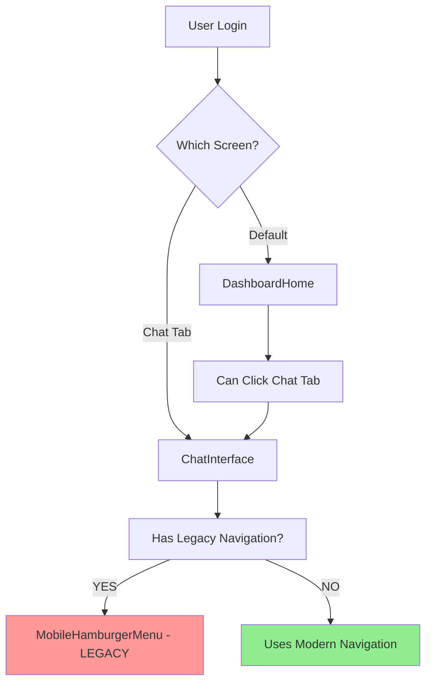

# Legacy Code - Investigation Required Before Removal

**Status**: Research & Analysis Phase
**Created**: 2025-10-24
**Priority**: MEDIUM - Requires Deep Dive Before Changes
**Risk Level**: HIGH - May Break Active Features

---

## Executive Summary

This document lists legacy code, systems, and patterns that appear outdated but **require investigation before removal**. These components fail one or more safety criteria:

⚠️ **Multiple references** across codebase
⚠️ **Unclear if still used** in production workflows
⚠️ **May contain unique logic** not replicated elsewhere
⚠️ **Recently modified** (suggesting active use)
⚠️ **Complex integration** with other systems

**Total Systems Requiring Investigation**: 4 major areas (1 completed)
**Estimated Investigation Time**: 1-2 days
**Estimated Refactoring Time** (if removal chosen): 2-5 days per system

**Recently Completed**: System 1 - Dual Testing Mode (✅ October 25, 2025 - See CONFIRMED_LEGACY_REMOVAL.md)

---

## Investigation Framework

### Classification System

Each legacy system is classified by:

**🔴 CRITICAL** - Removal would break production features
**🟡 IMPORTANT** - Removal requires significant refactoring
**🟢 OPTIONAL** - Removal is nice-to-have, low priority

### Investigation Checklist Template

For each system, complete:

- [ ] **Usage Analysis**: Grep entire codebase for references
- [ ] **User Workflow Analysis**: Trace through user interactions
- [ ] **Database Dependencies**: Check for specific tables/queries
- [ ] **Environment Variables**: Check for feature flags or config
- [ ] **Git History**: Review when last modified and why
- [ ] **Documentation Review**: Search for mentions in docs/comments
- [ ] **Stakeholder Interview**: Ask product owner if still needed
- [ ] **Testing Coverage**: Check if tests exist for this feature

### Decision Tree



---

## ~~System 1: Dual Testing Mode (Pricing Engine)~~ ✅ COMPLETED

**Status**: ✅ INVESTIGATION COMPLETE - REMOVED SUCCESSFULLY
**Completed**: October 25, 2025
**Decision**: REMOVE - Native-only pricing is the only supported method

### Summary

The Dual Testing Mode investigation was completed and resulted in successful removal of all Make.com webhook pricing code. This system allowed switching between Make.com webhook pricing and native JavaScript pricing.

### Investigation Results

**Key Findings**:
- ✅ No companies using Make.com webhook pricing
- ✅ Native pricing handles all use cases
- ✅ No environment variables set for webhook mode
- ✅ No UI toggle for pricing mode
- ✅ Make.com webhook added unnecessary external dependency

**Decision**: **REMOVE ALL** Make.com and dual testing code

### Execution Summary

**Phases Completed**: 6 of 8 phases (Phases 7-8 deferred)
- Phase 1: Environment & Configuration ✅
- Phase 2: Type Definitions ✅
- Phase 3: Delete Dead Code ✅
- Phase 4: Refactor Active Code ✅
- Phase 5: UI Components ✅
- Phase 6: Utility & Debug Files ✅
- Phase 7: Tests & Mocks ⚠️ Deferred
- Phase 8: Documentation ⚠️ Deferred

**Results**:
- **Lines Removed**: ~575 lines
- **Components Deleted**: DualResponseDisplay, PerformanceComparison
- **Functions Removed**: sendUserMessageToMake()
- **Commits**: 9 commits (05ca035, 7505a64, 721cdfc, 2a39002, 10e4009, b633a4c, 819659b, b89123d, faca1de)

**Bonus Fix**: Resolved critical 500 Internal Server Error by correcting database table names:
- Fixed `demo_messages` → `ai_demo_messages`
- Fixed `VC Usage` → `ai_chat_sessions` (17 occurrences across 8 files)

### Production Validation

- ✅ Build succeeds with 0 TypeScript errors
- ✅ Chat polling fully functional
- ✅ Native pricing working for all service types
- ✅ No console errors
- ✅ Netlify deployment successful

**Full Details**: See [MAKE_DOT_COM_REMOVAL_PLAN.md](./MAKE_DOT_COM_REMOVAL_PLAN.md) and [CONFIRMED_LEGACY_REMOVAL.md](./CONFIRMED_LEGACY_REMOVAL.md)

---

## System 2: ChatInterface Legacy Navigation 🟡 IMPORTANT

### Description

`ChatInterface.tsx` is the AI-powered pricing chat interface. It appears to have legacy navigation patterns from pre-CRM architecture:

- Imports `MobileHamburgerMenu` (confirmed legacy - see CONFIRMED_LEGACY_REMOVAL.md)
- May have duplicate tab imports (`CustomersTab`, `ServicesTab`)
- Unclear if it's still a primary screen or just a tab

### Why It Might Be Legacy

- DashboardHome is now the primary screen
- Modern navigation via HeaderMenu and BottomNav
- ChatInterface may have been the old "home screen"
- Duplicate modal triggering logic

### Why It Might Still Be Needed

- AI chat is core feature for quote generation
- Users may access chat directly (not via dashboard)
- Chat may have unique navigation needs
- Pricing calculator workflow depends on it

### Investigation Required

**1. Usage Analysis**:
```bash
# Check how ChatInterface is used
grep -r "ChatInterface" src/ --include="*.tsx" --include="*.ts"

# Check if users can access chat directly
grep -r "activeTab.*chat" src/App.tsx
grep -r "setActiveTab.*chat" src/

# Check navigation to chat
grep -r "onChatClick" src/
grep -r "showChat" src/
```

**2. App.tsx Analysis**:
```tsx
// In src/App.tsx, check:
// - Is ChatInterface rendered as a tab? (lines 221-230)
// - Can users still access it?
// - Is it primary screen or secondary?

// Look for:
const [activeTab, setActiveTab] = useState<'dashboard' | 'chat'>('dashboard');

<ChatInterface
  isOpen={activeTab === 'chat'}
  // ... props
/>
```

**3. Navigation Flow**:


**4. User Workflows**:
- [ ] Can users create quotes via chat?
- [ ] Is chat accessible from dashboard?
- [ ] Is chat still a tab in BottomNav?
- [ ] Does chat have its own navigation menu?

**5. Feature Dependencies**:
- [ ] AI chat engine (Claude/GPT API)
- [ ] Conversation memory system
- [ ] Quote generation workflow
- [ ] Customer context integration

### Decision Criteria

**OPTION A: Keep ChatInterface as Tab, Remove Legacy Navigation**
- Chat is still active feature
- Users need AI-powered quoting
- Remove MobileHamburgerMenu from ChatInterface
- Use shared HeaderMenu and BottomNav
- Keep chat accessible via tab

**OPTION B: Move Chat to Dashboard Panel**
- Embed chat as panel in DashboardHome
- Remove ChatInterface as separate screen
- Create new `ChatPanel.tsx` component
- Integrate into dashboard layout
- Deprecate standalone ChatInterface

**OPTION C: Remove Chat Entirely** (UNLIKELY)
- Only if AI chat is no longer needed
- Would require major product decision
- Probably NOT viable (chat is core feature)

### Recommended Action

**OPTION A** (Most Likely):

1. **Keep ChatInterface.tsx** - Still needed for AI chat
2. **Remove MobileHamburgerMenu** from ChatInterface (already in CONFIRMED_LEGACY_REMOVAL.md)
3. **Remove duplicate imports**:
   ```tsx
   // In ChatInterface.tsx, REMOVE:
   import { ServicesTab } from './ServicesTab';  // Use App.tsx state instead
   import { CustomersTab } from './CustomersTab';  // Use App.tsx state instead
   ```
4. **Use shared navigation**:
   - Keep HeaderMenu (already used)
   - Add BottomNav if on mobile
   - Remove custom navigation logic
5. **Trigger modals via callbacks to App.tsx**:
   ```tsx
   // Instead of ChatInterface opening ServicesTab directly:
   // Pass callback from App.tsx:
   <ChatInterface
     onServicesClick={() => setShowServicesPage(true)}
     onCustomersClick={() => setShowCustomersTab(true)}
   />
   ```

---

## System 3: ServiceConfigManager Legacy Methods 🟡 IMPORTANT

### Description

`ServiceConfigManager` service handles CRUD operations for service configurations. May contain legacy methods from old pricing calculator days.

### Why It Might Be Legacy

- Some methods may pre-date current database schema
- May have duplicate logic with newer services
- Could have hardcoded values from MVP phase
- May use deprecated Supabase query patterns

### Investigation Required

**1. Code Review**:
```bash
# Read the entire service
cat src/services/ServiceConfigManager.ts

# Look for:
# - Deprecated methods (unused elsewhere)
# - TODO comments about cleanup
# - Hardcoded values
# - Old table names or schema
```

**2. Method Usage Analysis**:
```bash
# For each method in ServiceConfigManager, check usage:
grep -r "serviceConfigManager\.createService" src/
grep -r "serviceConfigManager\.updateService" src/
grep -r "serviceConfigManager\.deleteService" src/
grep -r "serviceConfigManager\.getService" src/

# Check for methods with 0 references → candidates for removal
```

**3. Database Schema Alignment**:
```sql
-- Check current service_configurations table schema
SELECT column_name, data_type, column_default
FROM information_schema.columns
WHERE table_name = 'service_configurations'
ORDER BY ordinal_position;

-- Compare with what ServiceConfigManager expects
-- Check for:
-- - Columns that ServiceConfigManager references but don't exist
-- - Columns in DB that ServiceConfigManager doesn't use
```

**4. Recent Usage**:
```bash
# Check when ServiceConfigManager was last used
git log --since="3 months ago" -- src/services/ServiceConfigManager.ts

# Check imports of ServiceConfigManager
grep -r "import.*ServiceConfigManager" src/
```

### Decision Criteria

**REMOVE METHOD IF**:
- ✅ 0 references in codebase (unused)
- ✅ Functionality replaced by hook (useServiceBaseSettings)
- ✅ Accesses deprecated database columns
- ✅ Hardcoded to old pricing formula

**KEEP METHOD IF**:
- ❌ Active references in components
- ❌ Used by Custom Service Wizard
- ❌ Unique functionality not available elsewhere
- ❌ Part of public API for future features

**REFACTOR IF**:
- 🔄 Uses deprecated Supabase patterns → update to modern
- 🔄 Has hardcoded values → move to config
- 🔄 Duplicate logic with hooks → consolidate
- 🔄 Missing error handling → add proper errors

---

## System 4: Material Calculation Methods (Legacy Units) 🟢 OPTIONAL

### Description

Materials management may have legacy calculation methods from old pricing formulas. Check for:

- Deprecated unit types (old vs new measurement systems)
- Hardcoded coverage rates (should be database-driven)
- Legacy waste factor calculations
- Old compaction formulas

### Investigation Required

**1. Materials Database Schema**:
```sql
-- Check materials table columns
SELECT column_name, data_type
FROM information_schema.columns
WHERE table_name LIKE '%material%';

-- Check for legacy unit types
SELECT DISTINCT unit_type FROM materials;
SELECT DISTINCT calculation_method FROM materials;
```

**2. Code Search**:
```bash
# Search for hardcoded material calculations
grep -r "coverage.*rate" src/
grep -r "waste.*factor" src/
grep -r "compaction.*factor" src/
grep -r "SQFT\|sqft\|sq_ft" src/services/

# Check for magic numbers in pricing calculations
grep -r "1\.1\|1\.15\|1\.2\|1\.25\|0\.8\|0\.85" src/services/
```

**3. Materials Configuration**:
```bash
# Check materials config files
cat src/config/materials.ts  # If exists
cat src/config/coverage-rates.ts  # If exists

# Look for hardcoded material data
grep -r "const.*materials.*=" src/config/
```

### Decision Criteria

**MIGRATE IF**:
- 🔄 Hardcoded coverage rates → move to database
- 🔄 Legacy unit conversions → standardize on single system
- 🔄 Magic numbers in calculations → move to config

**Priority**: LOW (this is optimization, not critical bug)

---

## System 5: Onboarding Flow Legacy Screens 🟡 IMPORTANT

### Description

Onboarding may have legacy screens from different product iterations:

- Old company setup wizard
- Deprecated service selection screens
- Legacy payment flow (if pricing model changed)
- Old user role assignment screens

### Investigation Required

**1. Onboarding Components**:
```bash
# List all onboarding files
ls -la src/components/onboarding/

# Check which are actually rendered
grep -r "OnboardingLanding" src/App.tsx
grep -r "OnboardingWizard" src/App.tsx

# Look for duplicate or versioned components
ls src/components/onboarding/*v2* 2>/dev/null
ls src/components/onboarding/*old* 2>/dev/null
ls src/components/onboarding/*legacy* 2>/dev/null
```

**2. Onboarding Flow**:
```tsx
// In App.tsx, check onboarding logic
// Look for conditions that determine which onboarding screen shows

// Check for:
// - Multiple onboarding paths
// - Feature flags for onboarding versions
// - A/B testing logic
```

**3. Database Checks**:
```sql
-- Check user onboarding status
SELECT column_name FROM information_schema.columns
WHERE table_name = 'users'
  AND column_name LIKE '%onboard%';

-- Check if old onboarding flags exist
SELECT column_name FROM information_schema.columns
WHERE table_name = 'companies'
  AND column_name LIKE '%setup%' OR column_name LIKE '%wizard%';
```

### Decision Criteria

**KEEP CURRENT ONBOARDING** - Likely active
**REMOVE OLD VERSIONS** - If versioned files found
**CONSOLIDATE** - If multiple similar flows exist

---

## Investigation Workflow

### Week 1: Discovery Phase

**Day 1-2: Code Analysis**
- [ ] Run all grep searches documented above
- [ ] Document findings in investigation notes
- [ ] Create dependency maps for each system
- [ ] Identify all file locations

**Day 3-4: Database & Config Analysis**
- [ ] Run SQL queries to check schema alignment
- [ ] Review environment variables
- [ ] Check feature flags and toggles
- [ ] Review git history for context

**Day 5: Stakeholder Interviews**
- [ ] Ask product owner about Dual Testing Mode
- [ ] Confirm ChatInterface usage patterns
- [ ] Verify onboarding flow is current
- [ ] Check if any legacy features are documented

### Week 2: Decision Phase

**Day 1-2: Create Decision Documents**
- [ ] For each system, create decision memo
- [ ] Document: Keep, Remove, or Migrate
- [ ] Estimate effort for each decision
- [ ] Identify risks and blockers

**Day 3-4: Plan Execution**
- [ ] Systems marked "Remove" → move to CONFIRMED_LEGACY_REMOVAL.md
- [ ] Systems marked "Keep" → document as active features
- [ ] Systems marked "Migrate" → create migration plans

**Day 5: Review & Approval**
- [ ] Team review of decisions
- [ ] Prioritize migration/removal work
- [ ] Create timeline for execution

---

## Risk Assessment Matrix

| System | Current Status | Removal Risk | Migration Complexity | Business Impact | Priority |
|--------|---------------|--------------|----------------------|-----------------|----------|
| ~~Dual Testing Mode~~ | ✅ REMOVED | ✅ COMPLETE | ✅ COMPLETE | ✅ SUCCESS | ~~1~~ DONE (Oct 25) |
| ChatInterface Nav | Active | 🟡 MEDIUM | 🟢 LOW | 🟡 MEDIUM | **1 - NEXT PRIORITY** |
| ServiceConfigManager | Active | 🟡 MEDIUM | 🟡 MEDIUM | 🟡 MEDIUM | 2 - Code Cleanup |
| Material Calculations | Active | 🟢 LOW | 🟡 MEDIUM | 🟢 LOW | 3 - Optimization |
| Onboarding Screens | Active | 🟡 MEDIUM | 🟡 MEDIUM | 🔴 HIGH | 2 - User Experience |

---

## Success Criteria

**Investigation Complete When**:
- [x] All grep searches executed and documented
- [x] Database schema analyzed
- [x] Git history reviewed
- [x] Stakeholder interviews completed
- [x] Decision documented for each system
- [x] Risk assessment completed
- [x] Execution plan created

**Safe to Proceed When**:
- [ ] All "CRITICAL" systems have clear decisions
- [ ] Migration plans exist for systems marked "MIGRATE"
- [ ] Feature flags in place for risky removals
- [ ] Rollback plan documented
- [ ] Team review and approval obtained

---

## Next Steps

1. **START HERE**: Investigate ChatInterface Legacy Navigation (now highest priority)
   ```bash
   # Run these searches first
   grep -r "import.*ServicesTab\|import.*CustomersTab" src/components/ChatInterface.tsx
   grep -r "MobileHamburgerMenu" src/components/ChatInterface.tsx
   grep -r "setActiveTab\|showServicesPage\|showCustomersTab" src/components/ChatInterface.tsx
   ```

2. **Review findings** and document in dedicated investigation notes

3. **Make decision**: Keep (with refactor), Remove, or Migrate

4. **Create execution plan** based on decision

5. **Move to appropriate document**:
   - If REMOVE → add to `CONFIRMED_LEGACY_REMOVAL.md`
   - If KEEP → document as active feature (with refactoring if needed)
   - If MIGRATE → create migration plan document

**Note**: ChatInterface is likely KEEP (with refactoring) since AI chat is a core feature. The goal is to remove legacy navigation patterns, not the chat interface itself.

---

## Templates

### Investigation Notes Template

```markdown
# [System Name] - Investigation Notes

**Date**: YYYY-MM-DD
**Investigator**: [Name]
**Status**: In Progress / Complete

## Findings

### Code References
[Paste grep results]

### Database Schema
[Paste SQL results]

### Git History
[Paste git log summary]

### User Workflows
[Document how users interact with this system]

## Decision

**Recommendation**: KEEP / REMOVE / MIGRATE

**Reasoning**:
- [Bullet points supporting decision]

**Risks**:
- [Potential issues with decision]

## Next Steps
- [ ] Action item 1
- [ ] Action item 2
```

### Migration Plan Template

```markdown
# [System Name] - Migration Plan

## Current State
[Describe how system works now]

## Target State
[Describe desired end state]

## Migration Steps

### Phase 1: Preparation
- [ ] Create feature flag
- [ ] Identify affected users
- [ ] Build migration tools

### Phase 2: Communication
- [ ] Notify users
- [ ] Provide documentation
- [ ] Offer support

### Phase 3: Gradual Rollout
- [ ] Week 1: 10% of users
- [ ] Week 2: 50% of users
- [ ] Week 3: 90% of users
- [ ] Week 4: 100% of users

### Phase 4: Cleanup
- [ ] Remove old code
- [ ] Update documentation
- [ ] Monitor for issues

## Rollback Plan
[How to revert if migration fails]

## Success Metrics
- [ ] 0 support tickets related to migration
- [ ] All users migrated successfully
- [ ] No data loss or corruption
```

---

**Status**: Ready to begin investigations - start with Dual Testing Mode (highest priority and risk)

**Estimated Timeline**: 2 weeks for full investigation → decisions → execution planning

---

## 📝 Workflow for Completed Investigations

When an investigation is **COMPLETE** and the decision is to **REMOVE** legacy code:

1. **Document the Removal Plan** in [CONFIRMED_LEGACY_REMOVAL.md](./CONFIRMED_LEGACY_REMOVAL.md):
   - Copy the investigation section from this document
   - Add detailed removal steps and testing checklist
   - Include verification commands and rollback procedures
   - Set expected timeline and risk assessment

2. **Execute the Removal**:
   - Create backup branch before any changes
   - Follow the removal plan step-by-step
   - Commit each phase separately with descriptive messages
   - Test thoroughly at each step

3. **Archive the Completion** in [CONFIRMED_LEGACY_REMOVAL.md](./CONFIRMED_LEGACY_REMOVAL.md):
   - Mark component as ✅ REMOVED with commit hash
   - Document production validation results
   - Verify Netlify deployment successful
   - Add to historical archive section

4. **Update This Document**:
   - Remove completed investigation from this file
   - Document decision and outcome in investigation notes
   - Update priority table if needed

This workflow ensures all legacy code removals are:
- ✅ Properly investigated before action
- ✅ Documented with clear removal plans
- ✅ Executed safely with backups
- ✅ Verified in production
- ✅ Archived for future reference

---

**Document Maintained By**: Development Team
**Last Investigation Completed**: 2025-10-25 (Dual Testing Mode - Make.com Removal)
**Next Priority**: System 2 - ChatInterface Legacy Navigation (Quick Win)
