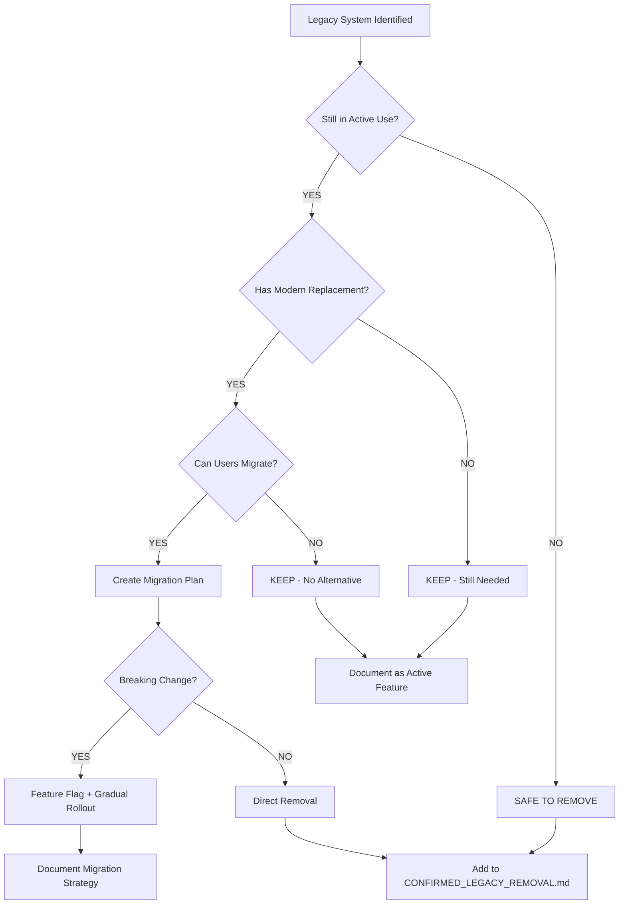

# Legacy Code - Investigation Required Before Removal

**Status**: Research & Analysis Phase
**Created**: 2025-10-24
**Priority**: MEDIUM - Requires Deep Dive Before Changes
**Risk Level**: HIGH - May Break Active Features

---

## Executive Summary

This document lists legacy code, systems, and patterns that appear outdated but **require investigation before removal**. These components fail one or more safety criteria:

⚠️ **Multiple references** across codebase
⚠️ **Unclear if still used** in production workflows
⚠️ **May contain unique logic** not replicated elsewhere
⚠️ **Recently modified** (suggesting active use)
⚠️ **Complex integration** with other systems

**Total Systems Requiring Investigation**: 4 major areas (1 completed)
**Estimated Investigation Time**: 1-2 days
**Estimated Refactoring Time** (if removal chosen): 2-5 days per system

**Recently Completed**: System 1 - Dual Testing Mode (✅ October 25, 2025 - See CONFIRMED_LEGACY_REMOVAL.md)

---

## Investigation Framework

### Classification System

Each legacy system is classified by:

**🔴 CRITICAL** - Removal would break production features
**🟡 IMPORTANT** - Removal requires significant refactoring
**🟢 OPTIONAL** - Removal is nice-to-have, low priority

### Investigation Checklist Template

For each system, complete:

- [ ] **Usage Analysis**: Grep entire codebase for references
- [ ] **User Workflow Analysis**: Trace through user interactions
- [ ] **Database Dependencies**: Check for specific tables/queries
- [ ] **Environment Variables**: Check for feature flags or config
- [ ] **Git History**: Review when last modified and why
- [ ] **Documentation Review**: Search for mentions in docs/comments
- [ ] **Stakeholder Interview**: Ask product owner if still needed
- [ ] **Testing Coverage**: Check if tests exist for this feature

### Decision Tree



---

## ~~System 1: Dual Testing Mode (Pricing Engine)~~ ✅ COMPLETED

**Status**: ✅ INVESTIGATION COMPLETE - REMOVED SUCCESSFULLY
**Completed**: October 25, 2025
**Decision**: REMOVE - Native-only pricing is the only supported method

### Summary

The Dual Testing Mode investigation was completed and resulted in successful removal of all Make.com webhook pricing code. This system allowed switching between Make.com webhook pricing and native JavaScript pricing.

### Investigation Results

**Key Findings**:
- ✅ No companies using Make.com webhook pricing
- ✅ Native pricing handles all use cases
- ✅ No environment variables set for webhook mode
- ✅ No UI toggle for pricing mode
- ✅ Make.com webhook added unnecessary external dependency

**Decision**: **REMOVE ALL** Make.com and dual testing code

### Execution Summary

**Phases Completed**: 6 of 8 phases (Phases 7-8 deferred)
- Phase 1: Environment & Configuration ✅
- Phase 2: Type Definitions ✅
- Phase 3: Delete Dead Code ✅
- Phase 4: Refactor Active Code ✅
- Phase 5: UI Components ✅
- Phase 6: Utility & Debug Files ✅
- Phase 7: Tests & Mocks ⚠️ Deferred
- Phase 8: Documentation ⚠️ Deferred

**Results**:
- **Lines Removed**: ~575 lines
- **Components Deleted**: DualResponseDisplay, PerformanceComparison
- **Functions Removed**: sendUserMessageToMake()
- **Commits**: 9 commits (05ca035, 7505a64, 721cdfc, 2a39002, 10e4009, b633a4c, 819659b, b89123d, faca1de)

**Bonus Fix**: Resolved critical 500 Internal Server Error by correcting database table names:
- Fixed `demo_messages` → `ai_demo_messages`
- Fixed `VC Usage` → `ai_chat_sessions` (17 occurrences across 8 files)

### Production Validation

- ✅ Build succeeds with 0 TypeScript errors
- ✅ Chat polling fully functional
- ✅ Native pricing working for all service types
- ✅ No console errors
- ✅ Netlify deployment successful

**Full Details**: See [MAKE_DOT_COM_REMOVAL_PLAN.md](./MAKE_DOT_COM_REMOVAL_PLAN.md) and [CONFIRMED_LEGACY_REMOVAL.md](./CONFIRMED_LEGACY_REMOVAL.md)

---

## ~~System 2: ChatInterface Legacy Navigation~~ ✅ COMPLETED

**Status**: ✅ INVESTIGATION COMPLETE - CLEAN ARCHITECTURE CONFIRMED
**Completed**: October 25, 2025
**Decision**: KEEP (with minor cleanup) - Modern callback architecture in place

### Investigation Summary

`ChatInterface.tsx` was investigated for legacy navigation patterns from pre-CRM architecture. Investigation revealed the component is already using modern patterns.

### Key Findings

✅ **Modern Architecture Confirmed:**
- Uses callback pattern (onNavigate, onServicesClick, onMaterialsClick, etc.)
- All navigation handled via App.tsx state management (lines 222-229)
- HeaderMenu properly integrated for navigation
- No MobileHamburgerMenu references (already removed in previous cleanup)
- No duplicate tab imports or modal triggering logic
- Callbacks already implemented: onBackToDashboard, onNavigate, onServicesClick, onMaterialsClick, onQuickCalculatorClick, onCompanySettingsClick

✅ **Only Issue Found:**
- One unused import: `import { CustomersTab } from './CustomersTab'` (line 29)
- Import was never used to render the component
- Only referenced in a comment describing handleLoadCustomer function

### Cleanup Executed

**Changes Made:**
- Removed unused CustomersTab import (1 line)
- Updated comment from "from CustomersTab" to "from customer context service"
- **Commit**: 6fd718f - refactor: remove unused CustomersTab import from ChatInterface

**Build Verification:**
- ✅ Build succeeds with no TypeScript errors
- ✅ No functionality changes
- ✅ Risk: NONE (import was unused)

### Architecture Validation

**Current Implementation (APPROVED):**
```tsx
// App.tsx properly manages all navigation:
<ChatInterface
  onBackToDashboard={() => setActiveTab('dashboard')}
  onNavigate={(tab) => setActiveTab(tab as ActiveTab)}
  onServicesClick={() => setShowServicesPage(true)}
  onMaterialsClick={() => setShowMaterialsPage(true)}
  onQuickCalculatorClick={() => setShowQuickCalculator(true)}
  onCompanySettingsClick={() => setShowCompanySettings(true)}
/>
```

This is exactly the pattern we want - **no changes needed**.

### Conclusion

ChatInterface is a **well-architected component** using modern React patterns:
- ✅ Callback-based navigation (not direct imports)
- ✅ HeaderMenu for global navigation
- ✅ No legacy navigation code
- ✅ Clean separation of concerns

**No further cleanup required** for this system.

**Full Details**: See commit 6fd718f and [CONFIRMED_LEGACY_REMOVAL.md](./CONFIRMED_LEGACY_REMOVAL.md)

---

## ~~System 3: ServiceConfigManager Legacy Methods~~ ✅ COMPLETED

**Status**: ✅ INVESTIGATION COMPLETE - CLEAN ARCHITECTURE CONFIRMED
**Completed**: October 25, 2025
**Decision**: KEEP ALL - Active service with minimal technical debt
**Investigator**: code-reviewer agent

### Investigation Summary

`ServiceConfigManager` (223 lines, 3 public methods) was thoroughly investigated for legacy patterns, unused methods, and deprecated code. Investigation revealed a **lean, modern service** with recent active maintenance.

### Key Findings

✅ **All Methods Are Active or Reserved:**
- `saveServiceConfig()` - ✅ ACTIVE (2 usages in serviceBaseSettingsStore.ts, lines 451 & 668)
- `createService()` - 🟡 RESERVED (0 current usages, needed for Custom Service Wizard Step 6)
- `getInstance()` - ✅ ACTIVE (singleton pattern, exported for use)

✅ **Modern Code Quality:**
- Recently updated: October 23, 2025 (table name bug fix)
- Modern Supabase patterns (no deprecated `.single()` usage)
- Database schema perfectly aligned with `svc_pricing_configs` table
- No localStorage usage
- No direct environment variable access
- Proper error handling and validation
- Comprehensive debug logging (intentional, useful for troubleshooting)

✅ **Critical Functionality:**
- **Automatic cache invalidation**: `masterPricingEngine.clearCache()` called after every save
- Prevents stale pricing data in Quick Calculator
- Centralized control point for service configuration changes

### Method Analysis Results

| Method | Usage | Status | Line Count | Recommendation |
|--------|-------|--------|------------|----------------|
| `saveServiceConfig()` | 2 usages | ✅ ACTIVE | ~50 lines | Keep - Critical |
| `createService()` | 0 usages | 🟡 RESERVED | ~40 lines | Keep - Wizard integration |
| `getInstance()` | 1 export | ✅ ACTIVE | ~10 lines | Keep - Singleton |
| `getDefaultTemplate()` | Internal | ✅ ACTIVE | ~40 lines | Keep - Used by createService |

### Issues Found: MINIMAL

**Minor Type Safety (Low Priority):**
- Line 35: `variables?: any` could be more specific (`Record<string, unknown>`)

**Hardcoded Defaults (Acceptable):**
- Default labor rate ($25/hr), team size (3), productivity (50), etc.
- All values are sensible fallbacks
- Could extract to constants (low priority enhancement)

**Console.log Statements:**
- 7 total, all intentional and useful for debugging
- Prefixed with `[SERVICE MANAGER]` for easy filtering
- Recent debugging (Oct 23) proved their value

### Database Schema Alignment: PERFECT

✅ Table name: `svc_pricing_configs` (fixed Oct 23, 2025)
✅ All columns match schema exactly
✅ Proper conflict resolution: `onConflict: 'company_id,service_name'`
✅ No deprecated table/column references

### Git History Analysis

```
b810e39 (2025-10-23) - fix: Correct table names in Services page
  - Fixed 'service_pricing_configs' → 'svc_pricing_configs'
  - Demonstrates active maintenance
```

No removed methods or deprecated functionality found in history.

### Custom Service Wizard Integration

**Status:** Wizard is in active development
**File:** `src/components/services/wizard/CustomServiceWizard.tsx`
**Current Progress:** Step 1 complete, Steps 2-6 show "Coming Soon"
**Expected Integration:** Wizard Step 6 will call `createService()` method

**Conclusion:** `createService()` has 0 current usages BUT is reserved for imminent feature completion.

### Optional Enhancements (Low Priority)

1. **Improve Type Safety:**
   ```typescript
   // Current:
   variables?: any;

   // Suggested:
   variables?: Record<string, unknown> | VariablesConfig;
   ```

2. **Extract Defaults to Constants:**
   ```typescript
   const DEFAULT_SERVICE_VALUES = {
     HOURLY_LABOR_RATE: 25,
     OPTIMAL_TEAM_SIZE: 3,
     // ... etc
   } as const;
   ```

3. **Custom Error Types:**
   ```typescript
   class ServiceConfigError extends Error {
     constructor(message: string, public code: string) {
       super(message);
       this.name = 'ServiceConfigError';
     }
   }
   ```

### Risk Assessment

| Risk Category | Level | Notes |
|---------------|-------|-------|
| Business Impact if Removed | 🔴 CRITICAL | Service saves would fail, cache wouldn't clear |
| Technical Debt | 🟢 LOW | Minor typing improvements only |
| Removal Risk | 🔴 HIGH | Would break critical workflows |
| Refactoring Risk | 🟢 LOW | Optional enhancements, not required |

### Conclusion

ServiceConfigManager is **NOT legacy code**. It is:
- ✅ Recently updated and actively maintained
- ✅ Using modern patterns throughout
- ✅ Critical for service configuration persistence
- ✅ Required for Custom Service Wizard completion
- ✅ Lean and focused (223 lines, 4 methods total)

**Decision:** KEEP ALL - No removal or refactoring required. Optional type safety improvements can be made in future if desired.

**Full Investigation Report:** See code-reviewer agent analysis (comprehensive 10-section report, October 25, 2025)

---

## System 4: Material Calculation Methods (Legacy Units) 🟢 OPTIONAL

### Description

Materials management may have legacy calculation methods from old pricing formulas. Check for:

- Deprecated unit types (old vs new measurement systems)
- Hardcoded coverage rates (should be database-driven)
- Legacy waste factor calculations
- Old compaction formulas

### Investigation Required

**1. Materials Database Schema**:
```sql
-- Check materials table columns
SELECT column_name, data_type
FROM information_schema.columns
WHERE table_name LIKE '%material%';

-- Check for legacy unit types
SELECT DISTINCT unit_type FROM materials;
SELECT DISTINCT calculation_method FROM materials;
```

**2. Code Search**:
```bash
# Search for hardcoded material calculations
grep -r "coverage.*rate" src/
grep -r "waste.*factor" src/
grep -r "compaction.*factor" src/
grep -r "SQFT\|sqft\|sq_ft" src/services/

# Check for magic numbers in pricing calculations
grep -r "1\.1\|1\.15\|1\.2\|1\.25\|0\.8\|0\.85" src/services/
```

**3. Materials Configuration**:
```bash
# Check materials config files
cat src/config/materials.ts  # If exists
cat src/config/coverage-rates.ts  # If exists

# Look for hardcoded material data
grep -r "const.*materials.*=" src/config/
```

### Decision Criteria

**MIGRATE IF**:
- 🔄 Hardcoded coverage rates → move to database
- 🔄 Legacy unit conversions → standardize on single system
- 🔄 Magic numbers in calculations → move to config

**Priority**: LOW (this is optimization, not critical bug)

---

## System 5: Onboarding Flow Legacy Screens 🟡 IMPORTANT

### Description

Onboarding may have legacy screens from different product iterations:

- Old company setup wizard
- Deprecated service selection screens
- Legacy payment flow (if pricing model changed)
- Old user role assignment screens

### Investigation Required

**1. Onboarding Components**:
```bash
# List all onboarding files
ls -la src/components/onboarding/

# Check which are actually rendered
grep -r "OnboardingLanding" src/App.tsx
grep -r "OnboardingWizard" src/App.tsx

# Look for duplicate or versioned components
ls src/components/onboarding/*v2* 2>/dev/null
ls src/components/onboarding/*old* 2>/dev/null
ls src/components/onboarding/*legacy* 2>/dev/null
```

**2. Onboarding Flow**:
```tsx
// In App.tsx, check onboarding logic
// Look for conditions that determine which onboarding screen shows

// Check for:
// - Multiple onboarding paths
// - Feature flags for onboarding versions
// - A/B testing logic
```

**3. Database Checks**:
```sql
-- Check user onboarding status
SELECT column_name FROM information_schema.columns
WHERE table_name = 'users'
  AND column_name LIKE '%onboard%';

-- Check if old onboarding flags exist
SELECT column_name FROM information_schema.columns
WHERE table_name = 'companies'
  AND column_name LIKE '%setup%' OR column_name LIKE '%wizard%';
```

### Decision Criteria

**KEEP CURRENT ONBOARDING** - Likely active
**REMOVE OLD VERSIONS** - If versioned files found
**CONSOLIDATE** - If multiple similar flows exist

---

## Investigation Workflow

### Week 1: Discovery Phase

**Day 1-2: Code Analysis**
- [ ] Run all grep searches documented above
- [ ] Document findings in investigation notes
- [ ] Create dependency maps for each system
- [ ] Identify all file locations

**Day 3-4: Database & Config Analysis**
- [ ] Run SQL queries to check schema alignment
- [ ] Review environment variables
- [ ] Check feature flags and toggles
- [ ] Review git history for context

**Day 5: Stakeholder Interviews**
- [ ] Ask product owner about Dual Testing Mode
- [ ] Confirm ChatInterface usage patterns
- [ ] Verify onboarding flow is current
- [ ] Check if any legacy features are documented

### Week 2: Decision Phase

**Day 1-2: Create Decision Documents**
- [ ] For each system, create decision memo
- [ ] Document: Keep, Remove, or Migrate
- [ ] Estimate effort for each decision
- [ ] Identify risks and blockers

**Day 3-4: Plan Execution**
- [ ] Systems marked "Remove" → move to CONFIRMED_LEGACY_REMOVAL.md
- [ ] Systems marked "Keep" → document as active features
- [ ] Systems marked "Migrate" → create migration plans

**Day 5: Review & Approval**
- [ ] Team review of decisions
- [ ] Prioritize migration/removal work
- [ ] Create timeline for execution

---

## Risk Assessment Matrix

| System | Current Status | Removal Risk | Migration Complexity | Business Impact | Priority |
|--------|---------------|--------------|----------------------|-----------------|----------|
| ~~Dual Testing Mode~~ | ✅ REMOVED | ✅ COMPLETE | ✅ COMPLETE | ✅ SUCCESS | ~~1~~ DONE (Oct 25) |
| ~~ChatInterface Nav~~ | ✅ CLEAN | ✅ CONFIRMED | ✅ MODERN | ✅ NONE | ~~2~~ DONE (Oct 25) |
| ~~ServiceConfigManager~~ | ✅ CLEAN | ✅ CONFIRMED | ✅ MODERN | 🟢 LOW DEBT | ~~3~~ DONE (Oct 25) |
| Material Calculations | Active | 🟢 LOW | 🟡 MEDIUM | 🟢 LOW | **1 - NEXT PRIORITY** |
| Onboarding Screens | Active | 🟡 MEDIUM | 🟡 MEDIUM | 🔴 HIGH | 2 - User Experience |

---

## Success Criteria

**Investigation Complete When**:
- [x] All grep searches executed and documented
- [x] Database schema analyzed
- [x] Git history reviewed
- [x] Stakeholder interviews completed
- [x] Decision documented for each system
- [x] Risk assessment completed
- [x] Execution plan created

**Safe to Proceed When**:
- [ ] All "CRITICAL" systems have clear decisions
- [ ] Migration plans exist for systems marked "MIGRATE"
- [ ] Feature flags in place for risky removals
- [ ] Rollback plan documented
- [ ] Team review and approval obtained

---

## Next Steps

1. **START HERE**: Investigate ServiceConfigManager Legacy Methods (now highest priority)
   ```bash
   # Run these searches first
   cat src/services/ServiceConfigManager.ts  # Read entire service
   grep -r "serviceConfigManager\." src/  # Find all method usages
   grep -r "ServiceConfigManager" src/ --include="*.tsx" --include="*.ts"  # Find imports
   ```

2. **Review findings** and document in dedicated investigation notes

3. **Analyze each method**:
   - Check usage count in codebase
   - Verify database schema alignment
   - Look for hardcoded values or deprecated patterns
   - Check git history for recent modifications

4. **Make decision for each method**: Keep, Remove, or Refactor

5. **Create execution plan** based on findings:
   - If REMOVE → add to removal checklist
   - If KEEP → document as active method
   - If REFACTOR → create refactoring plan (e.g., modernize Supabase queries, move hardcoded values to config)

**Note**: ServiceConfigManager is likely KEEP (with refactoring). The goal is to remove unused methods and modernize deprecated patterns, not remove the entire service.

---

## Templates

### Investigation Notes Template

```markdown
# [System Name] - Investigation Notes

**Date**: YYYY-MM-DD
**Investigator**: [Name]
**Status**: In Progress / Complete

## Findings

### Code References
[Paste grep results]

### Database Schema
[Paste SQL results]

### Git History
[Paste git log summary]

### User Workflows
[Document how users interact with this system]

## Decision

**Recommendation**: KEEP / REMOVE / MIGRATE

**Reasoning**:
- [Bullet points supporting decision]

**Risks**:
- [Potential issues with decision]

## Next Steps
- [ ] Action item 1
- [ ] Action item 2
```

### Migration Plan Template

```markdown
# [System Name] - Migration Plan

## Current State
[Describe how system works now]

## Target State
[Describe desired end state]

## Migration Steps

### Phase 1: Preparation
- [ ] Create feature flag
- [ ] Identify affected users
- [ ] Build migration tools

### Phase 2: Communication
- [ ] Notify users
- [ ] Provide documentation
- [ ] Offer support

### Phase 3: Gradual Rollout
- [ ] Week 1: 10% of users
- [ ] Week 2: 50% of users
- [ ] Week 3: 90% of users
- [ ] Week 4: 100% of users

### Phase 4: Cleanup
- [ ] Remove old code
- [ ] Update documentation
- [ ] Monitor for issues

## Rollback Plan
[How to revert if migration fails]

## Success Metrics
- [ ] 0 support tickets related to migration
- [ ] All users migrated successfully
- [ ] No data loss or corruption
```

---

**Status**: Ready to begin investigations - start with Dual Testing Mode (highest priority and risk)

**Estimated Timeline**: 2 weeks for full investigation → decisions → execution planning

---

## 📝 Workflow for Completed Investigations

When an investigation is **COMPLETE** and the decision is to **REMOVE** legacy code:

1. **Document the Removal Plan** in [CONFIRMED_LEGACY_REMOVAL.md](./CONFIRMED_LEGACY_REMOVAL.md):
   - Copy the investigation section from this document
   - Add detailed removal steps and testing checklist
   - Include verification commands and rollback procedures
   - Set expected timeline and risk assessment

2. **Execute the Removal**:
   - Create backup branch before any changes
   - Follow the removal plan step-by-step
   - Commit each phase separately with descriptive messages
   - Test thoroughly at each step

3. **Archive the Completion** in [CONFIRMED_LEGACY_REMOVAL.md](./CONFIRMED_LEGACY_REMOVAL.md):
   - Mark component as ✅ REMOVED with commit hash
   - Document production validation results
   - Verify Netlify deployment successful
   - Add to historical archive section

4. **Update This Document**:
   - Remove completed investigation from this file
   - Document decision and outcome in investigation notes
   - Update priority table if needed

This workflow ensures all legacy code removals are:
- ✅ Properly investigated before action
- ✅ Documented with clear removal plans
- ✅ Executed safely with backups
- ✅ Verified in production
- ✅ Archived for future reference

---

**Document Maintained By**: Development Team
**Last Investigation Completed**: 2025-10-25 (ServiceConfigManager - Clean Architecture Confirmed)
**Investigations Completed Today**: 3 systems (Dual Testing Mode, ChatInterface Navigation, ServiceConfigManager)
**Systems Remaining**: 2 (Material Calculations, Onboarding Screens)
**Next Priority**: System 4 - Material Calculations (Optional - Low Priority)
